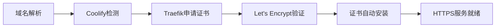

# 🚀 HTTPS 全栈应用开发部署计划

## 📋 项目概述
本项目是一个使用现代JavaScript技术栈（React + Node.js）开发的HTTPS全栈应用，通过Coolify平台实现自动化部署和HTTPS配置。

## 🎯 开发目标
1. ✅ 创建完整的JavaScript全栈项目结构
2. 🔄 完成本地开发与测试
3. 📤 上传代码到GitHub仓库
4. 🚀 使用Coolify进行自动化部署
5. 🔒 配置HTTPS安全访问
6. ✅ 验证部署结果与证书状态

## 📊 项目进度追踪

### ✅ 已完成任务
- [x] 创建项目根结构配置
- [x] 后端Node.js Express服务器搭建
- [x] 前端React + Vite应用开发
- [x] Docker容器化配置
- [x] 多环境部署准备
- [x] Git版本控制配置

### 🔄 进行中任务
- [ ] 本地开发环境配置与测试
- [ ] GitHub仓库创建与推送
- [ ] Coolify应用配置
- [ ] HTTPS证书自动化配置
- [ ] 生产环境验证

## 🛠️ 技术栈

### 后端技术
- **Runtime**: Node.js 18
- **Framework**: Express.js
- **安全中间件**: Helmet, CORS, Rate Limiting
- **容器化**: Docker + Docker Compose

### 前端技术  
- **Framework**: React 18
- **构建工具**: Vite
- **样式**: CSS3 + 响应式设计
- **部署**: Nginx生产服务器

### 部署平台
- **容器编排**: Docker
- **云平台**: Coolify
- **证书管理**: Let's Encrypt (自动)
- **反向代理**: Traefik (Coolify内置)

## 📝 详细开发部署流程

### 阶段一：本地开发测试 ✅

#### 1. 环境准备
```bash
# 安装根目录依赖
npm install

# 安装后端依赖
cd backend && npm install

# 安装前端依赖  
cd ../frontend && npm install
```

#### 2. 启动开发服务器
```bash
# 同时启动前后端开发服务器（根目录）
npm run dev

# 或分别启动
npm run server  # 后端: http://localhost:3001
npm run client  # 前端: http://localhost:5173
```

#### 3. 功能测试
- 访问前端应用验证界面渲染
- 测试后端API端点连通性
- 验证消息回显功能
- 检查健康状态监控

#### 4. 构建测试
```bash
# 测试生产构建
npm run build

# Docker本地测试
docker-compose up -d
```

### 阶段二：GitHub版本控制 📤

#### 1. 初始化Git仓库
```bash
# 初始化Git
git init

# 添加所有文件
git add .

# 提交初始版本
git commit -m "feat: 初始化HTTPS全栈项目"
```

#### 2. 创建GitHub仓库
- 访问 GitHub.com 创建新仓库
- 仓库名称: `https-fullstack-app`
- 描述: "Modern HTTPS fullstack application with React and Node.js"
- 权限: Public (推荐) 或 Private

#### 3. 推送代码到GitHub
```bash
# 添加远程仓库
git remote add origin https://github.com/your-username/https-fullstack-app.git

# 推送代码
git branch -M main
git push -u origin main
```

### 阶段三：Coolify自动化部署 🚀

#### 1. Coolify平台准备
- 确保Coolify服务正常运行
- 确认服务器资源充足
- 检查网络连通性

#### 2. 创建Coolify应用
1. 登录Coolify控制面板
2. 点击"Create New Resource"
3. 选择"Application"类型
4. 配置Git仓库连接

#### 3. 应用配置
```yaml
# Coolify 应用配置要点
- 源代码: GitHub仓库URL
- 构建方式: Dockerfile
- 端口映射: 3001 (后端), 80 (前端)
- 环境变量: 配置生产环境参数
- 资源限制: 适当的内存和CPU分配
```

#### 4. 部署设置
- 启用自动部署（Git Push触发）
- 配置健康检查路径
- 设置环境变量
- 配置持久化存储（如需要）

### 阶段四：HTTPS安全配置 🔒

#### 1. 域名准备
- 购买或准备域名
- 配置DNS解析到服务器IP
- 等待DNS生效（通常几分钟到几小时）

#### 2. Coolify HTTPS配置
1. 在Coolify应用中设置FQDN（完整域名）
2. 启用"Force HTTPS"选项
3. 配置SSL/TLS证书自动申请

#### 3. 证书自动化流程


#### 4. 验证HTTPS配置
```bash
# 使用curl验证HTTPS
curl -I https://your-domain.com

# 检查证书信息
openssl s_client -connect your-domain.com:443 -servername your-domain.com

# 在线SSL测试
# 访问: https://www.ssllabs.com/ssltest/
```

## 🐛 常见问题与解决方案

### 本地开发问题
1. **端口冲突**
   - 修改package.json中的端口配置
   - 使用不同的端口号

2. **依赖安装失败**
   - 清除node_modules重新安装
   - 检查Node.js版本兼容性

### GitHub推送问题
1. **认证失败**
   - 配置SSH密钥或使用Personal Access Token
   - 检查仓库权限设置

### Coolify部署问题
1. **构建失败**
   - 检查Dockerfile语法
   - 验证依赖包可用性

2. **服务无法访问**
   - 检查端口映射配置
   - 验证健康检查端点

### HTTPS配置问题
1. **证书申请失败**
   - 确认域名解析正确
   - 检查80/443端口开放状态
   - 验证服务器时间同步

2. **混合内容警告**
   - 确保所有资源使用HTTPS链接
   - 配置Content Security Policy

## 🔍 验证清单

### 本地开发验证 ✅
- [ ] 前端开发服务器正常启动
- [ ] 后端API接口可访问
- [ ] 功能交互正常
- [ ] 生产构建无错误

### GitHub配置验证 📤
- [ ] 仓库创建成功
- [ ] 代码推送完成
- [ ] 分支保护设置
- [ ] Webhook配置（可选）

### Coolify部署验证 🚀
- [ ] 应用创建成功
- [ ] 自动构建触发
- [ ] 容器运行正常
- [ ] 服务可访问

### HTTPS安全验证 🔒
- [ ] 域名解析正确
- [ ] HTTPS自动重定向
- [ ] SSL证书有效
- [ ] 安全评分达标

## 📞 技术支持与资源

### 文档资源
- [Coolify 官方文档](https://coolify.io/docs)
- [Let's Encrypt 文档](https://letsencrypt.org/docs/)
- [Docker 官方文档](https://docs.docker.com/)

### 故障排除
1. 查看Coolify部署日志
2. 检查容器运行状态
3. 验证网络连通性
4. 查阅相关技术文档

## 🎉 成功标准

- ✅ 本地开发环境完整可用
- ✅ 代码成功推送至GitHub  
- ✅ Coolify自动部署成功
- ✅ HTTPS证书自动申请并生效
- ✅ 生产环境服务稳定运行
- ✅ 所有功能验证通过

---

**最后更新**: {{当前日期}}
**项目状态**: 开发中
**负责人**: {{你的姓名}}